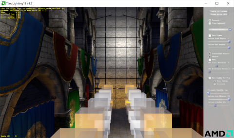

# AMD DX11 Compute-Based Tiled Lighting Sample

This sample provides an example implementation of two tile-based light culling methods: Forward+ and Tiled Deferred. Both methods support high numbers of dynamic lights while maintaining performance. They utilize a Direct3D 11 compute shader (DirectCompute 5.0) to divide the screen into tiles and quickly cull lights against those tiles.

In addition to standard point and spot lights, this sample supports shadow-casting lights (point and spot). Moreover, it extends tiled light culling to work with alpha-blended geometry. It can also spawn virtual point lights (VPLs) to approximate one-bounce global illumination, as seen in AMD's Leo Demo.

### Prerequisites
* AMD Radeon&trade; GCN-based GPU (HD 7000 series or newer)
* 64-bit Windows 7 (SP1 with the [Platform Update](https://msdn.microsoft.com/en-us/library/windows/desktop/jj863687.aspx)), Windows 8.1, or Windows 10
* Visual Studio 2012, Visual Studio 2013, or Visual Studio 2015

### Getting Started
* Visual Studio solutions for VS2012, VS2013, and VS2015 can be found in the `tiledlighting11\build` directory.
* Additional documentation can be found in the `tiledlighting11\doc` directory.

### Premake
The Visual Studio projects in the `tiledlighting11\build` directory were generated with Premake. To generate the project files yourself (for another version of Visual Studio, for example), open a command prompt in the `premake` directory and execute the following command:

* `update_vs_files_for_dx11_sample.bat tiledlighting11 [action]`
* For example: `update_vs_files_for_dx11_sample.bat tiledlighting11 vs2010`

This version of Premake has been modified from the stock version to use the property sheet technique for the Windows SDK from this [Visual C++ Team blog post](http://blogs.msdn.com/b/vcblog/archive/2012/11/23/using-the-windows-8-sdk-with-visual-studio-2010-configuring-multiple-projects.aspx). The technique was originally described for using the Windows 8.0 SDK with Visual Studio 2010, but it applies more generally to using newer versions of the Windows SDK with older versions of Visual Studio.

The default SDK for a particular version of Visual Studio (for 2012 or higher) is installed as part of Visual Studio installation. This default (Windows 8.0 SDK for Visual Studio 2012 and Windows 8.1 SDK for Visual Studio 2013) will be used if newer SDKs do not exist on the user's machine. However, the projects generated with this version of Premake will use the next higher SDK (Windows 8.1 SDK for Visual Studio 2012 and Windows 10 SDK with Visual Studio 2013), if the newer SDKs exist on the user's machine. For Visual Studio 2015, this version of Premake adds the WindowsTargetPlatformVersion element to the project file so that the Windows 10 SDK will be used.

### Third-Party Software
* DXUT is distributed under the terms of the MIT License. See `dxut\MIT.txt`.
* Premake is distributed under the terms of the BSD License. See `premake\LICENSE.txt`.
